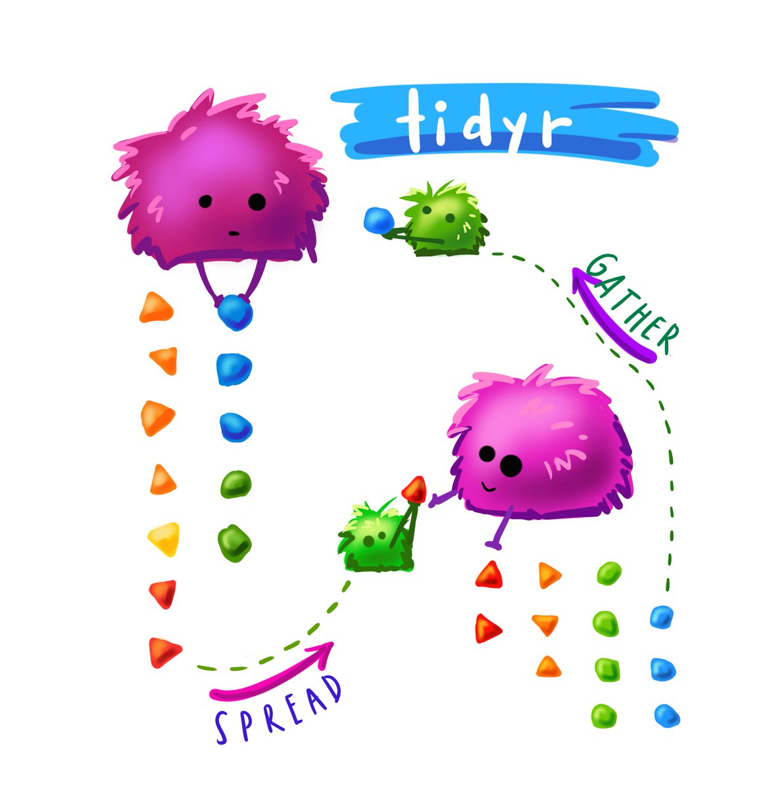
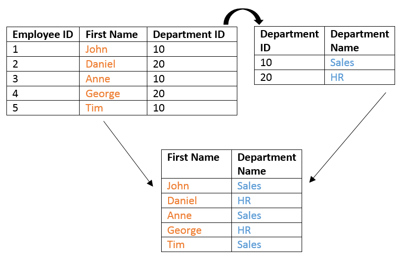
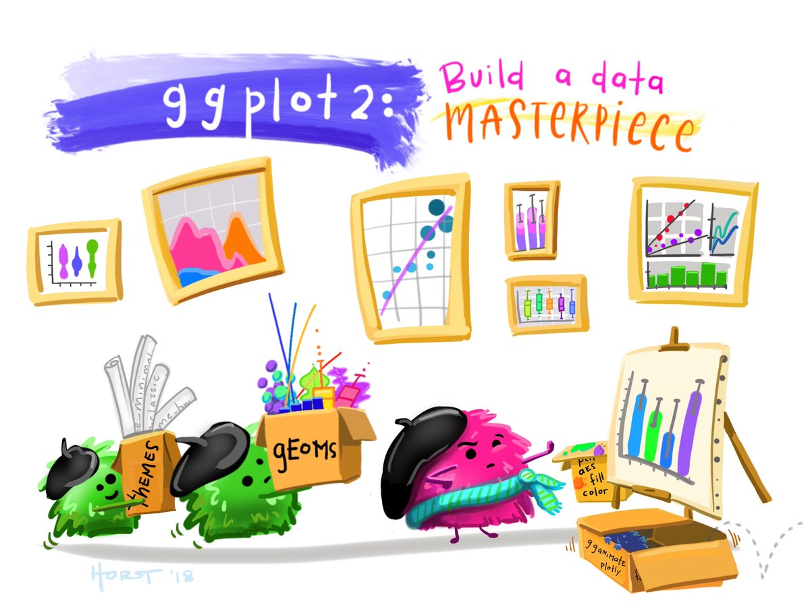
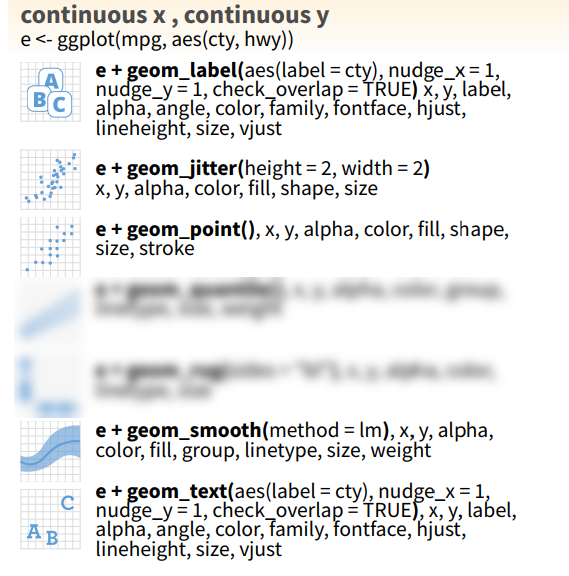
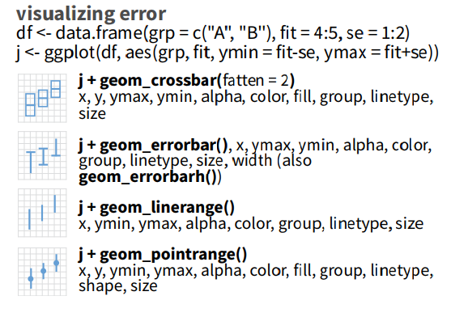
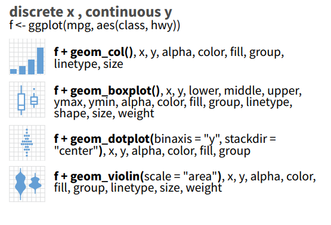
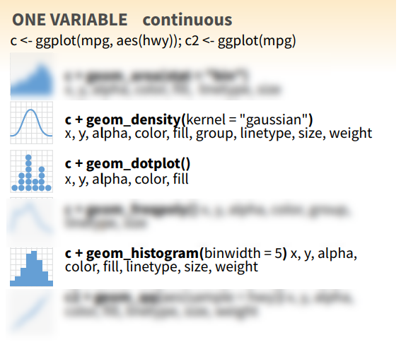

```{r setup, include=FALSE}
options(htmltools.dir.version = FALSE)
```

```{r, echo=FALSE}
# Define a function for formatting the dataframes

 my_kable <- function(df){
   options(knitr.kable.NA = '') 
   knitr::kable(df,"latex",row.names =FALSE, booktabs=T, linesep = "") %>%
      kableExtra::kable_styling(latex_options = c("scale_down", "striped"))
   }
```


# Tidy data


## Concept of tidy data

\vfill

1. Each variable must have its own column.
2. Each observation must have its own row.
2. Each value must have its own cell.

```{r, echo=FALSE, fig.cap="", out.width = '100%', fig.align= "center"}
knitr::include_graphics("../img/tidy-data.png")
```

\vfill

## Suggested reading

```{r, echo=FALSE, fig.cap="", out.width = '50%', fig.align= "center"}
knitr::include_graphics("../img/R_for_datascience.png")
```

# Initialize

## Load necessary libraries

\vfill

```{r libraries, message= FALSE, warning=FALSE}

library("readxl") # Import the data from Excel file
library("readr")  # Import the data from Excel file

library("dplyr")  # filter and reformat data frames
library("tidyr")  # make data tidy

library("ggplot2") # graphics
```

\vfill

# Read the data

## CARBOM cruise


```{r, echo=FALSE, fig.cap="", out.width = '70%', fig.align= "center"}
knitr::include_graphics("../img/carbom_cruise.png")
```
## Read the data - read_excel

```{r}
  samples <- readxl::read_excel("../data/CARBOM data.xlsx", 
                           sheet = "Samples_boat")
```

```{r, echo=FALSE}
  my_kable(head(select(samples, sample_number:level), 10))
```
* Showing only the first 10 rows
* There are missing values in the column __station__ because only recorded when changed

## Filling missing values - fill
```{r}
  
  samples <- tidyr::fill(samples, station)
  
```

```{r, echo=FALSE}
  my_kable(head(select(samples, sample_number:level), 10))
```

All missing values have been filled in.

- To read text files
    - __readr::read_tsv()__ : for tab delimited files
    - __readr::read_csv()__ : for comma delimited files

# Manipulate columns

## dplyr


```{r, echo=FALSE, out.width = '85%', fig.align= "center"}
knitr::include_graphics("../img/dplyr.jpg")
```

@allison_horst

## List the columns

```{r}
  colnames(samples)
```


## Select specific columns - select

```{r}
samples_select <- dplyr::select(samples, sample_number, transect, 
                                     station, depth, latitude, longitude, 
                                     picoeuks, nanoeuks, level)
```

```{r, echo=FALSE}
  my_kable(head(samples_select, 7))
```

Alternate syntax
```{r}
# Unselect some columns
  samples_select <- dplyr::select (samples, -bottom_depth, -transect_distance) # etc...
# Select a range of columns
  samples_select <- dplyr::select(samples, sample_number:nanoeuks, level)
```
* Note that column names are not "quoted"

## Using the pipe operator - %>% 

```{r}
  samples_select <- samples %>% dplyr::select(sample_number:nanoeuks, level)
```

```{r, echo=FALSE}
  my_kable(head(samples_select, 10))
```

* It is cleaner to write on 2 lines

```{r}
  samples_select <- samples %>% 
    dplyr::select(sample_number:nanoeuks, level)
```


## Creating new variables - mutate

```{r}
  samples_select <- samples_select %>% 
    dplyr::mutate(pico_pct = picoeuks/(picoeuks+nanoeuks)*100)
```

```{r, echo=FALSE}
  my_kable(head(samples_select, 10))
```

>- You can also use __transmute()__ but then it will drop all the other columns
-> It is much much better to do all derivative operations in R than in Excel, because you can easily track and correct errors.

## Using the pipe operator you can chain operations

```{r}
  samples_select <- samples  %>% 
    dplyr::select(sample_number:nanoeuks, level) %>% 
    dplyr::mutate(pico_pct = picoeuks/(picoeuks+nanoeuks)*100)
```

```{r, echo=FALSE}
  my_kable(head(samples_select, 10))
```


## Creating labels with mutate

```{r}
  samples_select <- samples_select %>% 
    dplyr::mutate(sample_label = paste0("TR",transect,"_St",station))
```

```{r, echo=FALSE}
  my_kable(head(samples_select, 10))
  samples_select <- samples_select %>% select(-sample_label)
```

## Rename specific columns - rename

```{r}
  samples_select <- samples_select %>% 
    dplyr::rename(pico_percent = pico_pct)
```

```{r, echo=FALSE}
  my_kable(head(samples_select, 10))
```

## Change table from wide to long form and conversely


```{r, echo=FALSE, out.width = '70%', fig.align= "center"}

```

@allison_horst

## Go from wide to long - gather

```{r, echo=FALSE, fig.cap="", out.width = '100%', fig.align= "center"}
knitr::include_graphics("../img/gathering.png")

```

```{r}
  samples_long <- samples_select  %>% 
    tidyr::gather(key="population", value="cell_ml", picoeuks, nanoeuks)
```

```{r, echo=FALSE}
  my_kable(head(samples_long))
```

## Go from long to wide - spread

```{r, echo=FALSE, fig.cap="", out.width = '80%', fig.align= "center"}
knitr::include_graphics("../img/spreading.png")
```

```{r}
  samples_wide <- samples_long  %>% 
    tidyr::spread(key="population", value="cell_ml")
```

```{r, echo=FALSE}
  my_kable(head(samples_wide))
```

# Manipulating rows

## Order rows - arrange

```{r}
  samples_select <- samples_select %>% 
    dplyr::arrange(transect, station)
```

```{r, echo=FALSE}
  my_kable(head(samples_select, 10))
```
* ! Station 6 is not ordered numerically.  It is because __station__ is a character column.


## Order rows - transform to numeric

```{r}
  samples_select <- samples_select %>% 
    dplyr::mutate(station = as.numeric(station)) %>% 
    arrange(transect, station)
```

```{r, echo=FALSE}
  my_kable(head(samples_select, 10))
```
* ! One station was named "Bloom" and then could not be converted to numerical (-> NA)


## Summarize rows - group_by / summarize

* Group by transect and station
* Compute mean of the percent picoplankton

```{r}
  samples_mean <- samples_select %>% 
    dplyr::group_by(transect, station, level) %>% 
    dplyr::summarise(n_samples = n(), 
              mean_pico_percent = mean(pico_percent, na.rm=TRUE))
```

```{r, echo=FALSE}
  my_kable(head(samples_mean, 8))
```

## Filtering rows - filter

* Get only the surface samples

```{r}
  samples_surf <- samples_select %>% 
    dplyr::filter(level == "Surf" ) 
```


```{r, echo=FALSE}
  my_kable(head(samples_surf, 10))
```

* ! Use the logical operators __==__ != > >= < <= is.na()


# Joining tables
## Joining tables

Very often you have tables that contain a common field and that you need to __join__ together.  A common example in oceanography

* Station - Longitude, Latitude
* CTD - Several CTD per station
* CTD profile - Parameter values at different depth
* Bottles
* Samples

In order to join 2 tables, they must have a common field. It is called the __KEY__. 

For example it can be station number or sample_number


```{r, echo=FALSE, fig.cap="", out.width = '60%', fig.align= "center"}

```

## Reading table with medtabarcoding samples

```{r}
  metabarcodes <- readxl::read_excel("../data/CARBOM data.xlsx", 
                           sheet = "Samples_metabarcodes")
```
### Table metabarcodes  
_For metabarcoding, each sample has been split into 2 fractions by sorting : pico- and nano-._

```{r, echo=FALSE}
  metabarcodes <- metabarcodes %>% arrange(sample_number) 
  my_kable(head(metabarcodes, 5))
```

### Tables samples

```{r, echo=FALSE}
  samples_select <- samples_select %>% arrange(sample_number) 
  my_kable(head(samples_select, 5))
```

* The two tables have a common field called __sample_number__ (KEY).

## Joining metabarcode and sample tables.

```{r}
  metabarcodes_join <- left_join(metabarcodes, samples_select)
```

```{r, echo=FALSE}
  my_kable(head(metabarcodes_join, 10))
```

## Joining metabarcode and sample tables.

* If the __KEY__ do not have the same name in the two tables it is possible to specify the name of the two columns used for joining.

```{r}
  metabarcodes <- metabarcodes %>% 
    rename(sample_code = sample_number)
```

```{r, echo=FALSE}
  my_kable(head(metabarcodes, 5))
```

```{r}
  metabarcodes_join <- left_join(metabarcodes, samples_select, 
                            by= c("sample_code" = "sample_number"))
```

```{r, echo=FALSE}
  my_kable(head(metabarcodes_join, 10))
```

## Joining with missing data

```{r}
  samples_select <- samples_select %>% 
    filter(sample_number != "10")
```

```{r, echo=FALSE}
  my_kable(head(samples_select, 5))
```

```{r}
  metabarcodes_join <- left_join(metabarcodes, samples_select, 
                            by= c("sample_code" = "sample_number"))
```

```{r, echo=FALSE}
  my_kable(head(metabarcodes_join, 10))
```


# Displaying the data

## ggplot2


```{r, echo=FALSE, out.width = '85%', fig.align= "center"}

```

@allison_horst

## A simple plot
* Choose the data set
* Choose the geometric representation
* Choose the __aesthetics__ : x,y, color, shape etc...

```{r, out.width = '60%', fig.align="center"}
 ggplot(samples) + 
  geom_point(mapping = aes(x=phosphates, y=nitrates))
```
* All functions are from __ggplot2__ package unless specified

## Make dot size bigger

* Add: __size=5__

```{r, out.width = '60%', fig.align="center", warning=FALSE}
 ggplot(samples) + 
  geom_point(mapping = aes(x=phosphates, y=nitrates), size=5)
```
## Color according to depth level

* Add: __color=level__

```{r, out.width = '60%', fig.align="center"}
 ggplot(samples) + 
  geom_point(mapping = aes(x=phosphates, y=nitrates,color=level), size=5) 
```
* The mapping aesthetics must be an argument of the aes function:
* geom_point(mapping = aes(x=phosphates, y=nitrates), __color=level__, size=5) will generate an error...

## Adding a regression line

* Add: __geom_smooth()__

```{r, out.width = '60%', fig.align="center", warning=FALSE}
 ggplot(samples) + 
  geom_point(mapping = aes(x=phosphates, y=nitrates,color=level), size=5) +
  geom_smooth(mapping = aes(x=phosphates, y=nitrates), method="lm")
```
* You can choose the type of smoothing "lm" is for linear model

## Finalizing the graph

```{r, out.width = '80%', fig.align="center", warning=FALSE}
 ggplot(samples) + 
  geom_point(mapping = aes(x=phosphates, y=nitrates,color=level), size=5) +
  geom_smooth(mapping = aes(x=phosphates, y=nitrates), method="lm") +
  xlab("Phosphates") + ylab("Nitrates") + ggtitle("CARBOM cruise")
```

## A lot of geom - Continuous x and y

```{r, echo=FALSE, fig.cap="", out.width = '80%', fig.align= "center"}

```

## A lot of geom - Plotting error

```{r, echo=FALSE, fig.cap="", out.width = '80%', fig.align= "center"}

```


## A lot of geom - Discrete x - Continuous y

```{r, echo=FALSE, fig.cap="", out.width = '80%', fig.align= "center"}

```

## A lot of geom - Continuous x

```{r, echo=FALSE, fig.cap="", out.width = '80%', fig.align= "center"}

```


# Final words
## Other useful packages

\vfill

### stringr - manipulate strings
- str_c: concatenate strings (cf paste and paste0)
- str_detect: to find a specific string
- str_replace: to replace a string
    
### lubridate - manipulate date

### tibble - manipulate data frame
* e.g. row names -> column or reverse

\vfill

## Useful links

\vfill

* R for data science: https://r4ds.had.co.nz/

* R graph gallery: https://www.r-graph-gallery.com/

* Dplyr manipulating tables: https://suzan.rbind.io/2018/01/dplyr-tutorial-1/

\vfill
