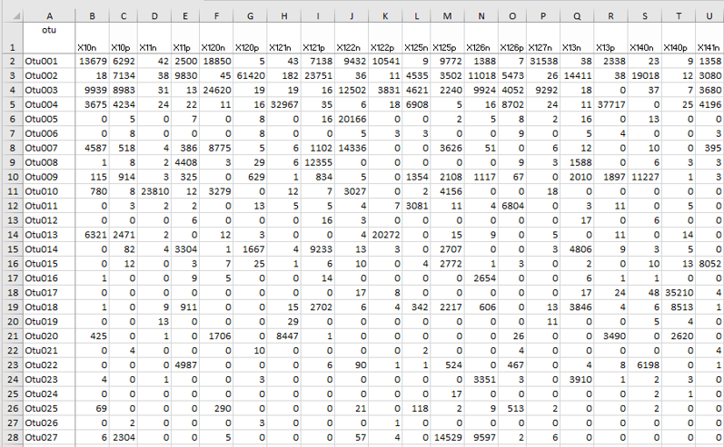
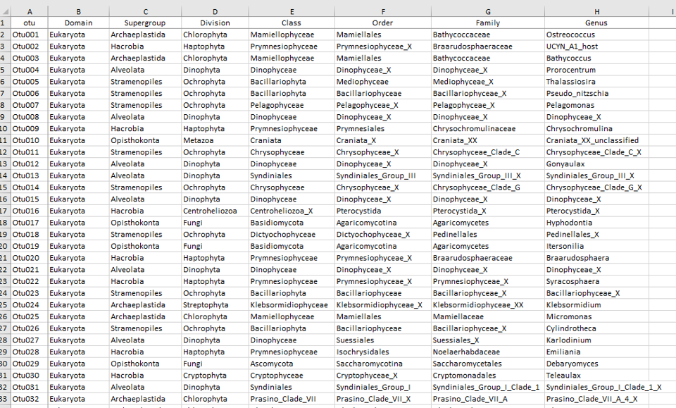
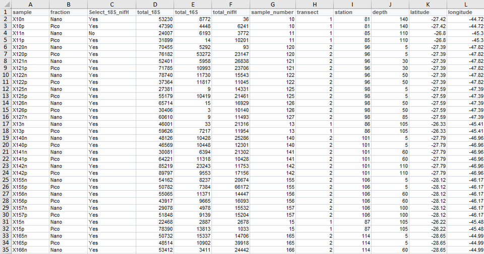

```{r knitr_init, echo=FALSE, warning=FALSE, cache=TRUE}
library(knitr)
library(rmdformats)
library("kableExtra")

## Global options
# The following line is necessary to make sure that 
# everything is not reevaluated each time the file is knit
# Note : in the case of this report it is necessary to leave cache= FALSE

options(max.print="75")
knitr::opts_chunk$set(fig.width=8, 
                      fig.height=6, 
                      eval=TRUE, 
                      cache=TRUE,
                      echo=TRUE,
                      prompt=FALSE,
                      tidy=TRUE,
                      comment=NA,
                      message=FALSE,
                      warning=FALSE)
opts_knit$set(width=85)
```
# Aim

This document explains the use of the phyloseq R library to analyze metabarcoding data.

# Phyloseq R library

* Phyloseq web site : https://joey711.github.io/phyloseq/index.html
* See in particular tutorials for
    - importing data: https://joey711.github.io/phyloseq/import-data.html
    - heat maps: https://joey711.github.io/phyloseq/plot_heatmap-examples.html

# Data  


```{r, echo=FALSE, fig.cap="Carbom cruise", out.width = '100%', fig.align= "center"}
knitr::include_graphics("../img/carbom_cruise.png")
```

This tutorial uses a reduced metabarcoding dataset obtained by C. Ribeiro and A. Lopes dos Santos.  This dataset originates from the CARBOM cruise in 2013 off Brazil and corresponds to the 18S V4 region amplified on flow cytometry sorted samples (see pptx file for details) and sequenced on an Illumina run 2*250 bp analyzed with mothur.

## References for data

* Gérikas Ribeiro, C., Lopes dos Santos, A., Marie, D., Helena Pellizari, V., Pereira Brandini, F., and Vaulot, D. (2016). Pico and nanoplankton abundance and carbon stocks along the Brazilian Bight. PeerJ 4, e2587. doi:10.7717/peerj.2587.
* Gérikas Ribeiro, C., Marie, D., Lopes dos Santos, A., Pereira Brandini, F., and Vaulot, D. (2016). Estimating microbial populations by flow cytometry: Comparison between instruments. Limnol. Oceanogr. Methods 14, 750–758. doi:10.1002/lom3.10135.
* Gérikas Ribeiro C, Lopes dos Santos A, Marie D, Brandini P, Vaulot D. (2018). Relationships between photosynthetic eukaryotes and nitrogen-fixing cyanobacteria off Brazil. ISME J in press.

```{r, echo=FALSE, fig.cap="Carbom paper in ISME", out.width = '100%', fig.align= "center"}
knitr::include_graphics("../img/carbom_isme.png")
```


# To be added

* Exercices


# Prerequisites to be installed

* R : https://pbil.univ-lyon1.fr/CRAN/

* R studio : https://www.rstudio.com/products/rstudio/download/#download

* Download this tutorial from GitHub : https://github.com/vaulot/R_tutorials/archive/master.zip

* Download and install the following libraries by running under R studio the following lines

```R
install.packages("dplyr")     # To manipulate dataframes
install.packages("readxl")    # To read Excel files into R

install.packages("ggplot2")   # for high quality graphics

source("https://bioconductor.org/biocLite.R")
biocLite("phyloseq")        
```
# Gettin started

* Transfer  the files that you downloaded from https://github.com/vaulot/R_tutorials/archive/master.zip to a directory on the computer or server you are using "C:/R_tutorial" or "home/R_tutorial"

* Navigate  to the /R_tutorial/phyloseq directory.  You should see the following files :

```console
Phyloseq_tutorial.Rmd
```

* Double click on the file and this should open R Studio

```{r, echo=FALSE, fig.cap="R studio", out.width = '100%', fig.align= "center"}
knitr::include_graphics("../img/r_studio.png")
```

* Run the "R chunks" 

# Step by step

## Load necessary libraries


```{r libraries, message=FALSE}
library("phyloseq")
library("ggplot2")      # graphics
library("readxl")       # necessary to import the data from Excel file
library("dplyr")        # filter and reformat data frames
library("tibble")       # Needed for converting column to row names
```

## Read the data and create phyloseq objects

Change your working directory to where the files are located

Three tables are needed

* OTU
* Taxonomy
* Samples

They are read from a single Excel file where each sheet contains one of the tables

```{r, echo=FALSE, fig.cap="Table OTU - OTU abundance", out.width = '100%', fig.align= "center"}

```

```{r, echo=FALSE, fig.cap="Table Taxo - OTU taxonomy", out.width = '100%', fig.align= "center"}

```

```{r, echo=FALSE, fig.cap="Table Samples", out.width = '100%', fig.align= "center"}

```


```{r}
  otu_mat<- read_excel("../data/CARBOM data.xlsx", sheet = "OTU matrix")
  tax_mat<- read_excel("../data/CARBOM data.xlsx", sheet = "Taxonomy table")
  samples_df <- read_excel("../data/CARBOM data.xlsx", sheet = "Samples")
```
Phyloseq objects need to have row.names

* define the row names from the otu column

```{r}
  otu_mat <- otu_mat %>%
    tibble::column_to_rownames("otu") 
```

* Idem for the two other matrixes 

```{r, warning=FALSE}

  tax_mat <- tax_mat %>% 
    tibble::column_to_rownames("otu")

  samples_df <- samples_df %>% 
    tibble::column_to_rownames("sample") 

```

Transform into matrixes otu and tax tables (sample table can be left as data frame)

```{r}
  otu_mat <- as.matrix(otu_mat)
  tax_mat <- as.matrix(tax_mat)
```

Transform to phyloseq objects

```{r}
  OTU = otu_table(otu_mat, taxa_are_rows = TRUE)
  TAX = tax_table(tax_mat)
  samples = sample_data(samples_df)
  
  carbom <- phyloseq(OTU, TAX, samples)
  carbom
```  
  
Visualize data
```{r}
  sample_names(carbom)
  rank_names(carbom)
  sample_variables(carbom)
```

Keep only samples to be analyzed
```{r}
  carbom <- subset_samples(carbom, Select_18S_nifH =="Yes")
  carbom
```


Keep only photosynthetic taxa
```{r}
  carbom <- subset_taxa(carbom, Division %in% c("Chlorophyta", "Dinophyta", "Cryptophyta", 
                                                "Haptophyta", "Ochrophyta", "Cercozoa"))
  carbom <- subset_taxa(carbom, !(Class %in% c("Syndiniales", "Sarcomonadea")))
  carbom
```

Normalize number of reads in each sample using median sequencing depth.
```{r}
  total = median(sample_sums(carbom))
  standf = function(x, t=total) round(t * (x / sum(x)))
  carbom = transform_sample_counts(carbom, standf)
```

The number of reads used for normalization is **`r sprintf("%.0f", total)`**. 

\pagebreak

## Bar graphs 

Basic bar graph based on Division
```{r}
  plot_bar(carbom, fill = "Division")
```

\pagebreak


Make the bargraph nicer by removing OTUs boundaries.  This is done by adding ggplot2 modifier.
```{r}
  plot_bar(carbom, fill = "Division") + 
  geom_bar(aes(color=Division, fill=Division), stat="identity", position="stack")
```

\pagebreak

Regroup together Pico vs Nano samples

```{r, warning=FALSE}
  carbom_fraction <- merge_samples(carbom, "fraction")
  plot_bar(carbom_fraction, fill = "Division") + 
  geom_bar(aes(color=Division, fill=Division), stat="identity", position="stack")
```

\pagebreak

Keep only Chlorophyta and use color according to genus. Do separate panels Pico vs Nano and Surface vs Deep samples.
```{r}
  carbom_chloro <- subset_taxa(carbom, Division %in% c("Chlorophyta"))
  plot_bar(carbom_chloro, x="Genus", fill = "Genus", facet_grid = level~fraction) +
  geom_bar(aes(color=Genus, fill=Genus), stat="identity", position="stack")
```

\pagebreak

## Heatmaps

A basic heatmap using the default parameters.
```{r}
  plot_heatmap(carbom, method = "NMDS", distance = "bray")
```  

\pagebreak


It is very very cluttered.  It is better to only consider the most abundant OTUs for heatmaps. For example one can only take OTUs that represent at least 20% of reads in at least one sample. Remember we normalized all the sampples to median number of reads (total).  We are left with only 33 OTUS which makes the reading much more easy.
```{r}
  carbom_abund <- filter_taxa(carbom, function(x) sum(x > total*0.20) > 0, TRUE)
  carbom_abund
  otu_table(carbom_abund)[1:8, 1:5]
  plot_heatmap(carbom_abund, method = "NMDS", distance = "bray")
```

\pagebreak

It is possible to use different distances and different multivaraite methods.  For example Jaccard distance and MDS and label OTUs with Class,  order by Class. We can also change the Palette (the default palette is a bit ugly...).
```{r}
  plot_heatmap(carbom_abund, method = "MDS", distance = "(A+B-2*J)/(A+B-J)", 
               taxa.label = "Class", taxa.order = "Class", 
               trans=NULL, low="beige", high="red", na.value="beige")
```
Many different built-in distances can be used

```{r}
dist_methods <- unlist(distanceMethodList)
print(dist_methods)

```

You can also buid your own distances.

For vectors x and y the "quadratic" terms are J = sum(x*y), A = sum(x^2), B = sum(y^2) and "minimum" terms are J = sum(pmin(x,y)), A = sum(x) and B = sum(y), and "binary" terms are either of these after transforming data into binary form (shared number of species, and number of species for each row).  Somes examples :

* A+B-2*J	"quadratic"	 squared Euclidean

* A+B-2*J	"minimum"	 Manhattan

* (A+B-2*J)/(A+B)	"minimum"	 Bray-Curtis

* (A+B-2*J)/(A+B)	"binary"	 Sørensen

* (A+B-2*J)/(A+B-J)	"binary"	 Jaccard


\pagebreak

Another strategy is to do a heatmap for a specific taxonomy group.  

For example we can taget the Chlorophyta and then label the OTUs using the Genus.

```{r}
  plot_heatmap(carbom_chloro, method = "NMDS", distance = "bray", 
               taxa.label = "Genus", taxa.order = "Genus", 
               low="beige", high="red", na.value="beige")
```

\pagebreak

## Alpha diversity

Plot Chao1 richness estimator and Shannon diversity estimator.
```{r}
  plot_richness(carbom, measures=c("Chao1", "Shannon"))
```


\pagebreak

Regroup together samples from the same fraction.
```{r, warning=FALSE}
  plot_richness(carbom, measures=c("Chao1", "Shannon"), x="level", color="fraction")
```

\pagebreak

## Ordination

Do multivariate analysis based on Bray-Curtis distance and NMDS ordination.

```{r}
  carbom.ord <- ordinate(carbom, "NMDS", "bray")
```

\pagebreak

Plot **OTUs**
```{r}
  plot_ordination(carbom, carbom.ord, type="taxa", color="Class", shape= "Division", 
                  title="OTUs")
```

\pagebreak

A bit confusing, so make it more easy to visualize by breaking according to taxonomic division.
```{r}
  plot_ordination(carbom, carbom.ord, type="taxa", color="Class", 
                  title="OTUs", label="Class") + 
                  facet_wrap(~Division, 3)
```

\pagebreak


Now display **samples** and enlarge the points to make it more easy to read.
```{r}
  plot_ordination(carbom, carbom.ord, type="samples", color="fraction", 
                  shape="level", title="Samples") + geom_point(size=3)
```

\pagebreak

Display both samples and OTUs but in 2 different panels.
```{r}
  plot_ordination(carbom, carbom.ord, type="split", color="Class", 
                  shape="level", title="biplot", label = "station") +  
  geom_point(size=3)
```

\pagebreak

## Network analysis

Simple network analysis
```{r}
  plot_net(carbom, distance = "(A+B-2*J)/(A+B)", type = "taxa", 
           maxdist = 0.7, color="Class", point_label="Genus")
```

\pagebreak

This is quite confusing.  Let us make it more simple by using only major OTUs 
```{r}
  plot_net(carbom_abund, distance = "(A+B-2*J)/(A+B)", type = "taxa", 
           maxdist = 0.8, color="Class", point_label="Genus") 
```

  


  


